# Assignment 3: Responsive Web Design

**Name:** Bakhtiyar Koishin  
**Group:** SE-2540

## Goal

Practice media queries and Bootstrap by making a responsive portfolio.

## Files

-index.html: portfolio.
-media.html: about me, without Bootstrap.
-bootstrap.html: skills, using Bootstrap.
-style.css: styles for all three pages.
- screenshots/: screenshots of the pages.

Open `index.html` in a browser.
An internet connection is needed to load Bootstrap from the CDN.

## Part 1: Media Queries

### Task 0: Responsive Typography

The About page uses media queries to change heading and paragraph sizes.
The main heading is 28px on mobile, 32px on tablet, and 36px on desktop.

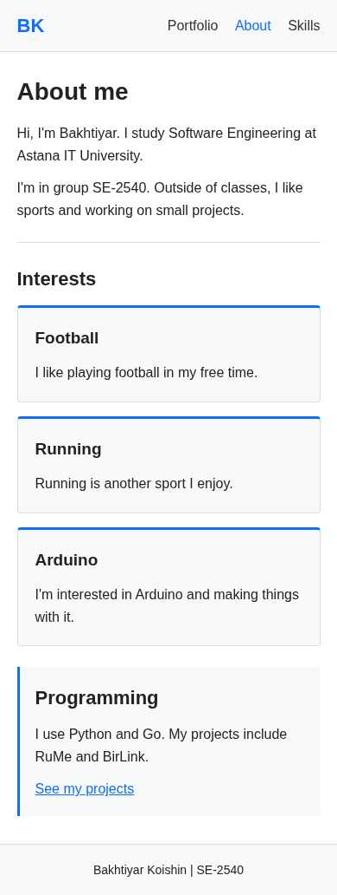
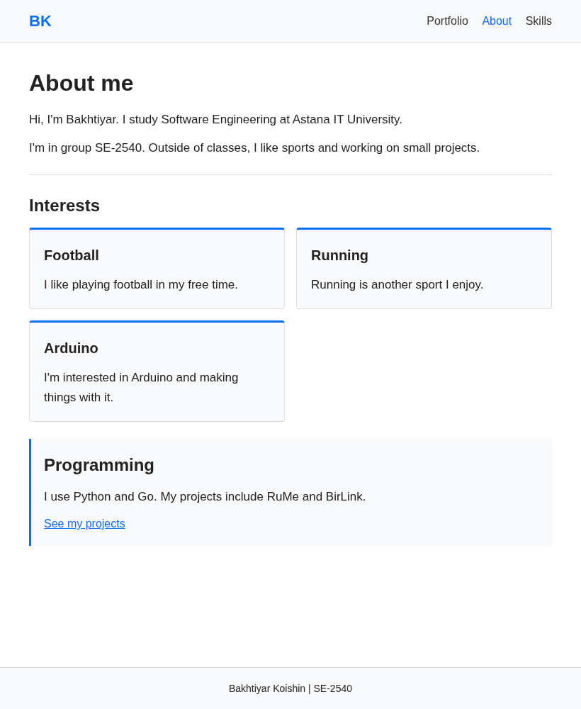
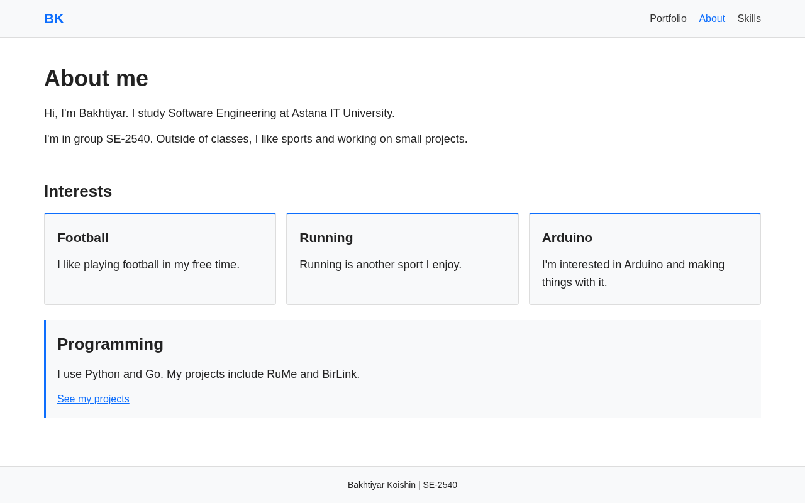

### Task 1: Responsive Layout

The three interest boxes use CSS Grid without Bootstrap.
Below 768px, there is one column. From 768px, there are two columns.
From 992px, all three boxes are in one row.

## Part 2: Bootstrap Grid System

### Task 2: Bootstrap Responsive Columns

The Skills page uses `container`, `row`, and `col-12 col-md-6 col-lg-4`.
Each box takes 12 columns on mobile, 6 on tablet, and 4 on desktop.

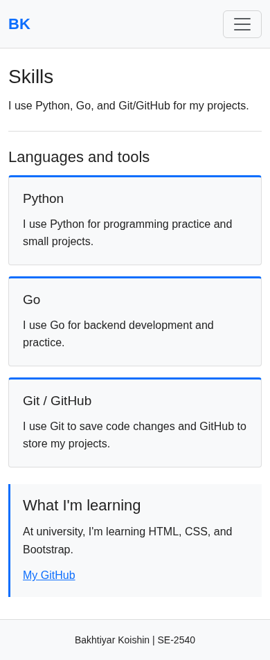
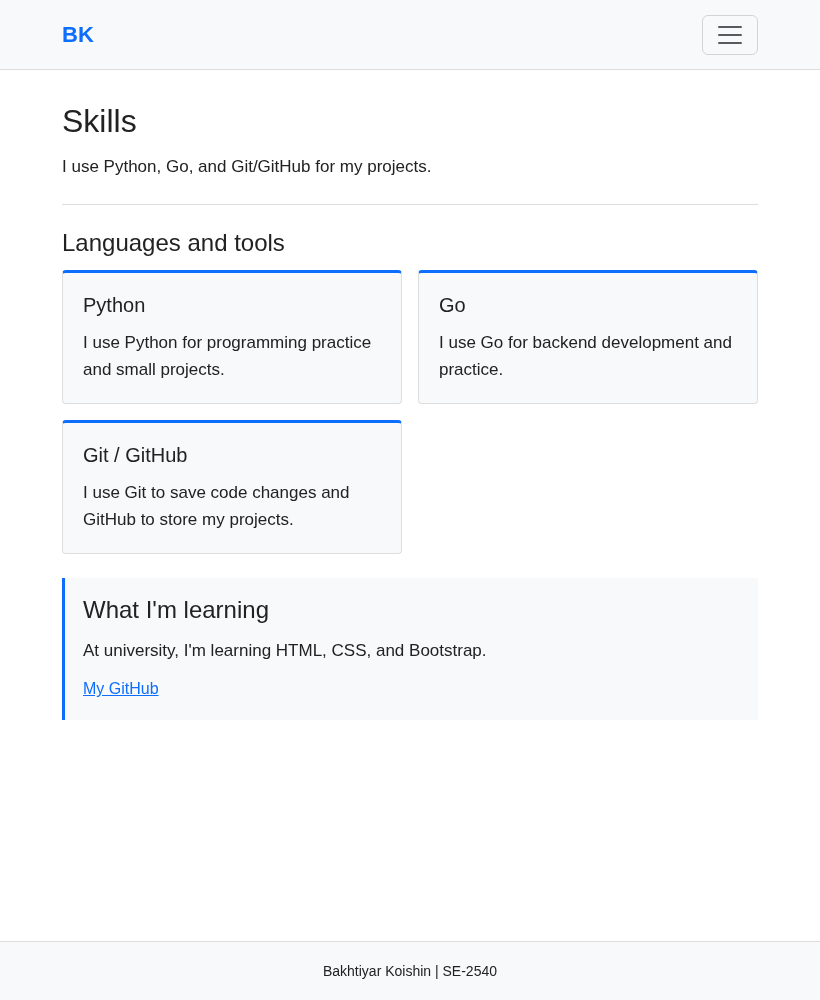
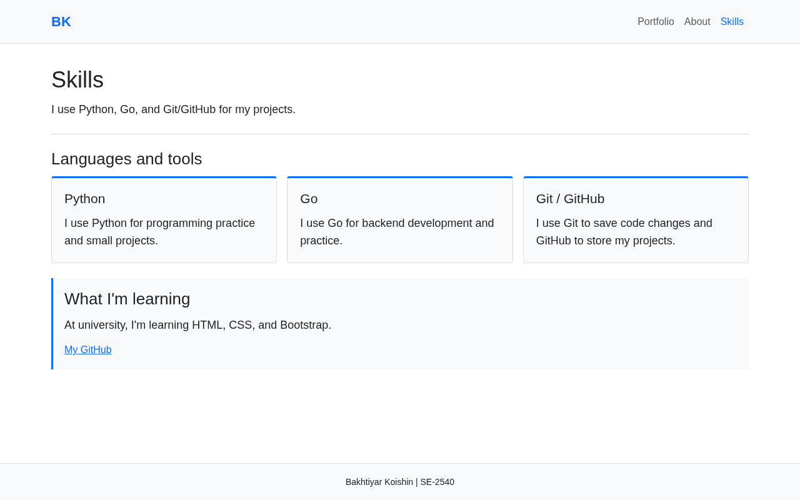

### Task 3: Bootstrap Navigation Bar

The navbar has a BK text logo on the left and links on the right.
Below 992px, the links are inside a hamburger menu.
The Bootstrap JavaScript bundle opens and closes it.

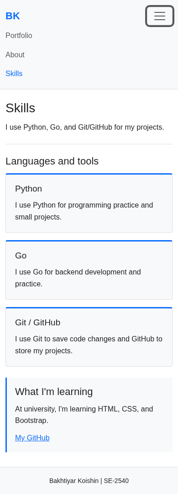

## Part 3: Combined Project

### Task 4: Responsive Portfolio Page

The portfolio has a Bootstrap navbar, project cards, a sidebar, and a footer.
On desktop, the projects take 8 columns and the sidebar takes 4.
On smaller screens, the sidebar moves below the projects.

Media queries change font sizes and main section padding.
The extra paragraph about my interests is hidden below 768px.
The contact details stay visible on all screen sizes.

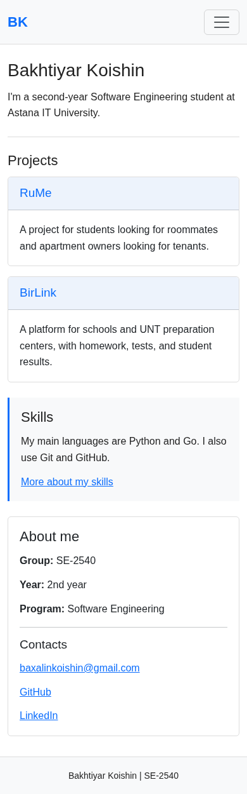
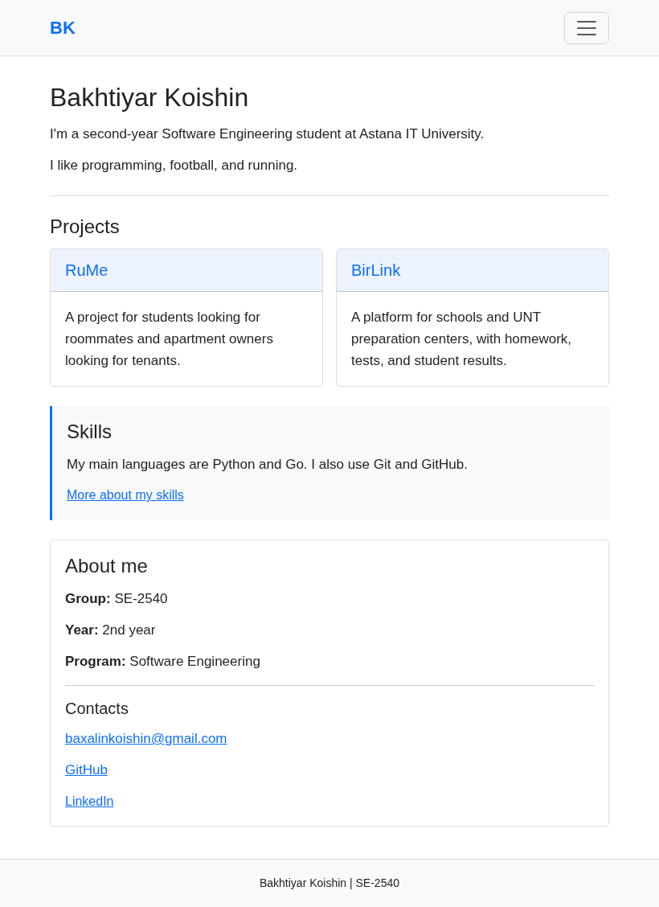
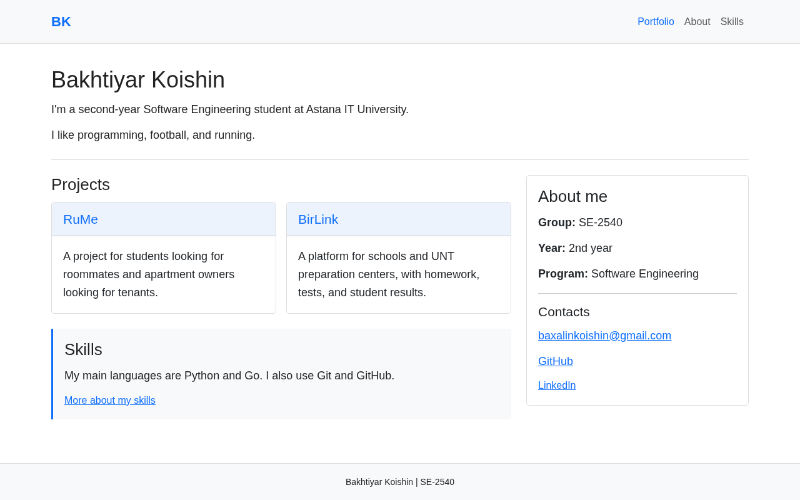
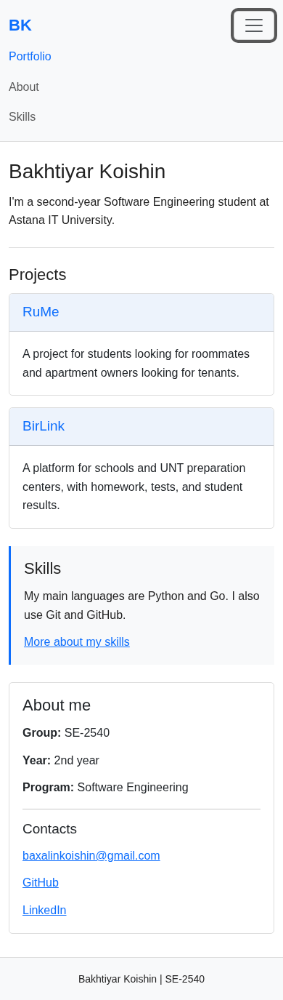

## Work Process

The About page was built first with HTML and CSS.
The Skills page uses Bootstrap for its columns and menu.
The portfolio combines both approaches.
The pages were checked at 390px, 820px, and 1280px.

## Conclusion

Media queries let me change styles at different screen widths.
Bootstrap classes help arrange columns and add a working navbar.

## Materials

- `Week4_frontend.pptx`
- `assignment3_frontend.docx`